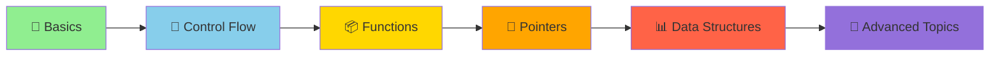

<div align="center">

# 🚀 C Language Learning Journey


### 💡 *Mastering the fundamentals of C programming, one program at a time!*

---

</div>

## 📋 Table of Contents
- [🎯 About](#-about)
- [📂 Programs](#-programs)
- [⚡ Quick Start](#-quick-start)
- [🛠️ Requirements](#️-requirements)
- [📚 Learning Path](#-learning-path)
- [🤝 Contributing](#-contributing)
- [📬 Connect](#-connect)

---

## 🎯 About

Welcome to my **C Programming Learning Repository**! 🎓

This repository serves as a comprehensive collection of C programs I've written while mastering the fundamentals and advanced concepts of C programming. Each program is carefully crafted to demonstrate specific programming concepts and best practices.

<div align="center">

### ⭐ Star this repo if you find it helpful! ⭐

</div>

---

## � Programs

<table>
<tr>
<td align="center" width="50%">

### 🔢 Number Pattern Program


**File:** `number pattern.c`

A beautiful triangular number pattern generator that demonstrates nested loops and formatted output in C.

**✨ Output:**
```
1 
1 2 
1 2 3 
1 2 3 4 
1 2 3 4 5
```

</td>
<td align="center" width="50%">

### � More Coming Soon!


Stay tuned for more exciting programs covering:
- 🔄 Data Structures
- 🧮 Algorithms
- 🎮 Mini Projects
- 💾 File Operations

</td>
</tr>
</table>

---

## ⚡ Quick Start

### 🎬 Running Your First Program

<details>
<summary><b>📝 Step-by-Step Guide</b></summary>

<br>

**1️⃣ Navigate to the project directory:**
```bash
cd "om c lab"
```

**2️⃣ Compile the program:**
```bash
# For number pattern
gcc "number pattern.c" -o number_pattern

# For alphabet pattern
gcc "Alphabet pattern.c" -o alphabet_pattern
```

**3️⃣ Run the executable:**
```bash
# Run number pattern
./number_pattern

# Run alphabet pattern
./alphabet_pattern
```

</details>

### ⚡ One-Line Execution
```bash
gcc "number pattern.c" -o number_pattern && ./number_pattern
```

---

## 🛠️ Requirements

<div align="center">

| Tool | Description | Installation |
|:----:|:-----------:|:------------:|
|  | **GCC Compiler** | Pre-installed on macOS/Linux |
|  | **Terminal/Shell** | Built-in on all systems |
|  | **Code Editor** | VS Code, Vim, or any editor |

</div>

### 💻 Platform-Specific Setup

```bash
# macOS (usually pre-installed)
xcode-select --install

# Linux (Debian/Ubuntu)
sudo apt-get install gcc

# Windows
# Install MinGW or use WSL (Windows Subsystem for Linux)
```

---

## 📚 Learning Path

<div align="center">



</div>

### 🎓 What I'm Learning

<table>
<tr>
<td width="33%" align="center">

#### 🔰 Fundamentals
- ✅ Basic Syntax
- ✅ Data Types
- ✅ Operators
- 🔄 Variables & Constants

</td>
<td width="33%" align="center">

#### 🎯 Core Concepts
- 🔄 Loops & Conditions
- 📦 Functions
- 🔗 Arrays & Strings
- 🎯 Pointers

</td>
<td width="33%" align="center">

#### 🚀 Advanced
- 💾 File I/O
- 🏗️ Data Structures
- 🧮 Algorithms
- � Memory Management

</td>
</tr>
</table>

---

## 🤝 Contributing

Found a bug? 🐛 Have a suggestion? 💡

Feel free to:
- 🍴 Fork this repository
- ⭐ Star it if you like it
- 🐛 Report issues
- 💬 Share your feedback

---

## 📬 Connect

<div align="center">

### Let's Connect and Learn Together! 🤝

[](https://github.com/omrajputt369-byte)
[](https://linkedin.com)
[](mailto:your.email@example.com)

</div>

---

<div align="center">

### � Happy Coding! 🚀

*"The only way to learn a new programming language is by writing programs in it."* - Dennis Ritchie


</div>
